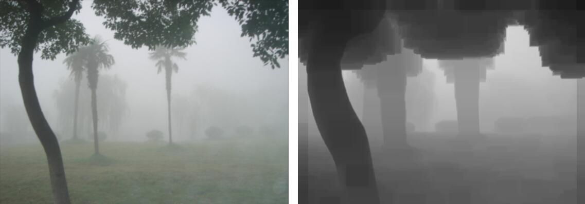
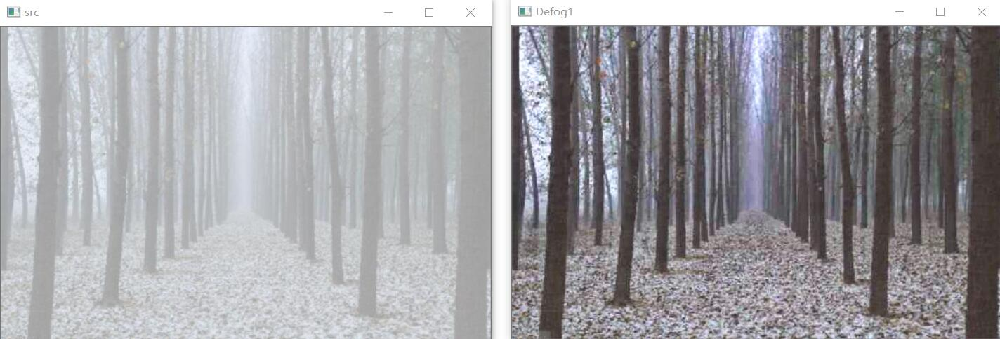
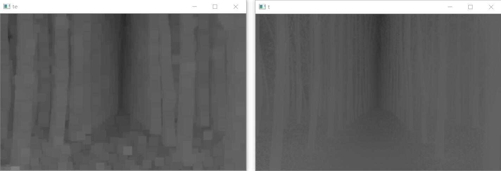
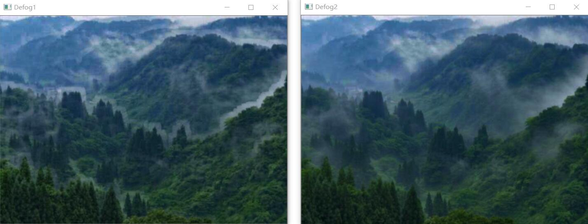
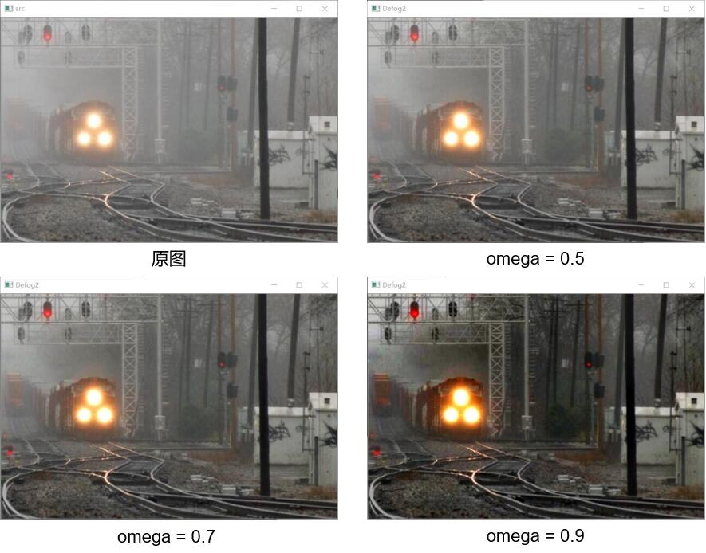
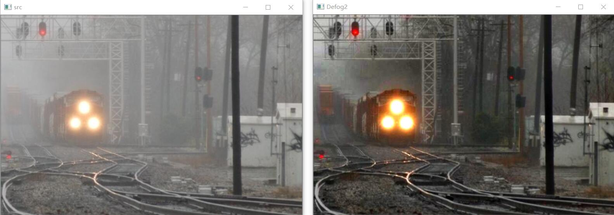

# USV-Competition


This is a project about Zhuhai Wanshan International Smart Boat Open Event(IIVC). The code in this repository is for the vision module.


## 第一部分：目标颜色物体检测


## 第二部分：暗通道去雾算法

### 1. 引言

通过之前的一些资料收集，发现经典的（非深度学习）去雾算法要属何凯明博士在2009年`CVPR`上发表的基于暗通道先验理论的去雾算法最为优雅和实用。并且后面的所有经典算法都是在暗通道先验理论的基础上做文章，尤其是透射率的获取上面，可见其影响有多深远。

> CVPR的中文名是计算机视觉与模式识别会议，是计算机视觉领域最顶尖的国际会议之一。09年的CVPR共收到约1450篇投稿，其中393篇文章被接收，接收率为26%。只有一篇文章被选为当年的最佳论文（就是何凯明博士的去雾算法这篇论文）。这是CVPR创立25年以来首次由中国人获得这个奖项。

下面将介绍该算法的基本原理和编程实现，并通过实验效果对其做必要的说明和讨论。


### 2. 算法理论介绍

#### 2.1 暗通道先验

在绝大多数非大面积天空的局部区域里，某一些像素总会有至少一个颜色通道具有很低的值。换言之，该区域光强度的最小值是个很小的数。论文给暗通道下了一个数学定义，对于任意的输入图像 $J$，其暗通道可以用下式表达：

$$
J^{\mathrm{dark}}(\mathbf{x})=\min _{\mathbf{y} \in \Omega(\mathbf{x})}\left(\min _{c \in\{r, g, b\}} J^{c}(\mathbf{y})\right)
$$

式中 $J_c$ 表示彩色图像的每个通道 ，$\Omega(x)$表示以像素X为中心的一个窗口。该式的意义用代码表达也很简单，首先求出每个像素RGB分量中的最小值，存入一副和原始图像大小相同的灰度图中，然后再对这幅灰度图进行最小值滤波，滤波的半径(R)由窗口大小决定，一般有: $WindowSize = 2 * R + 1$；

暗通道先验的理论指出：
$$
J^{\text {dark }} \rightarrow 0
$$
实际生活中造成暗原色中低通道值主要有三个因素：

* 汽车、建筑物和城市中玻璃窗户的阴影，或者是树叶、树与岩石等自然景观的投影；
* 色彩鲜艳的物体或表面，在RGB的三个通道中有些通道的值很低（比如绿色的草地／树／植物，红色或黄色的花朵／叶子，或者蓝色的水面）；
* 颜色较暗的物体或者表面，例如灰暗色的树干和石头。总之，自然景物中到处都是阴影或者彩色，这些景物的图像的暗原色总是很灰暗的。

举几个例子：


而对于有雾的图像，其暗通道要明显泛白：




由上述几幅图像，可以明显的看到暗通道先验理论的普遍性。在作者的论文中，统计了5000多副图像的特征，也都基本符合这个先验，因此，我们可以认为其是一条定理。

#### 2.2 理论推导

在计算机视觉和计算机图形中，下述方程所描述的雾图形成模型被广泛使用：
$$
I(\mathbf{x}) = J(\mathbf{x})t(\mathbf{x})+A(1-t(\mathbf{x}))
$$

其中，$I(\mathbf{x})$ 就是我们现在已经有的图像（待去雾的图像），$J(\mathbf{x})$ 是我们要恢复的无雾的图像，$A$ 是全球大气光成分， $t(\mathbf{x})$ 为透射率。现在的已知条件就是 $I(\mathbf{x})$，要求目标值 $J(\mathbf{x})$，显然，这是个有无数解的方程，因此，就需要一些先验的辅助了。

将式（1）稍作处理，变形为下式：

$$
\frac{I^{c}(\mathbf{x})}{A^{c}}=t(\mathbf{x}) \frac{J^{c}(\mathbf{x})}{A^{c}}+1-t(\mathbf{x})
$$
如上所述，上标 $c$ 表示 R/G/B 三个通道的意思。（注：OpenCV中，默认为BGR的顺序）。

首先假设在每一个窗口内透射率 $t(\mathbf{x})$ 为常数，定义为 $\tilde{t}(\mathbf{x})$，并且 $A$ 值已经给定，然后对式（4）两边求两次最小值运算，得到下式：

$$
\min _{\mathbf{y} \in \Omega(\mathbf{x})}\left(\min _{c} \frac{I^{c}(\mathbf{y})}{A^{c}}\right)=\tilde{t}(\mathbf{x}) \min _{\mathbf{y} \in \Omega(\mathbf{x})}\left(\min _{c} \frac{J^{c}(\mathbf{y})}{A^{c}}\right) +1-\tilde{t}(\mathbf{x})
$$
上式中，$J$ 是待求的无雾的图像，根据前述的暗原色先验理论有：
$$
J^{\mathrm{dark}}(\mathbf{x})=\min _{\mathbf{y} \in \Omega(\mathbf{x})}\left(\min _{c} J^{c}(\mathbf{y})\right) = 0
$$
因此，可推导出：
$$
\min _{\mathbf{y} \in \Omega(\mathbf{x})}\left(\min _{c} \frac{J^{c}(\mathbf{y})}{A^{c}}\right)=0
$$
将式（7）带入式（5）：
$$
\tilde{t}(\mathbf{x}) = 1-\min _{\mathbf{y} \in \Omega(\mathbf{x})}\left(\min _{c} \frac{I^{c}(\mathbf{y})}{A^{c}}\right)
$$
这就是透射率 $t(\mathbf{x})$ 的预估值。

在现实生活中，即使是晴天白云，空气中也存在着一些颗粒，因此，看远处的物体还是能感觉到雾的影响，另外，雾的存在让人类感到景深的存在，因此，有必要在去雾的时候保留一定程度的雾，这可以通过在式（8）中引入一个在[0,1] 之间的因子 $\omega$，则式（8）修正为：
$$
\tilde{t}(\mathbf{x}) = 1-\omega \min _{\mathbf{y} \in \Omega(\mathbf{x})}\left(\min _{c} \frac{I^{c}(\mathbf{y})}{A^{c}}\right)
$$
通常，$\omega=0.95$ 。

上述推论中都是假设全球大气光值 $A$ 是已知的，在实际中，我们可以借助于暗通道图来从有雾图像中获取该值。具体步骤如下：

1. 从暗通道图中按照亮度的大小取前0.1%的像素（取高亮度像素）。
2. 在这些位置中，在原始有雾图像 $I$ 中寻找对应的具有最高亮度的点的值，作为 $A$ 值。

到这一步，我们就可以进行无雾图像的恢复了。由式（3）可知： $J=(I-A)/t+A$。现在 $I、A、t$  都已知，可以进行 $J$ 的解算：
$$
\mathbf{J}(\mathbf{x})=\frac{\mathbf{I}(\mathbf{x})-\mathbf{A}}{t(\mathbf{x})}+\mathbf{A}
$$
当投射图 $t$ 的值很小时，会导致 $J$ 的值偏大，从而使图像整体向白场过度，因此一般可设置一阈值 $t_0$，当 $t$ 值小于 $t_0$ 时，令 $t = t_0$。（本文中所有效果图均以 $t_0 = 0.1$ 为标准进行计算）因此，最终的恢复公式如下：
$$
\mathbf{J}(\mathbf{x})=\frac{\mathbf{I}(\mathbf{x})-\mathbf{A}}{\max \left(t(\mathbf{x}), t_{0}\right)}+\mathbf{A}
$$


### 3. 基于 OpenCV 的编程实现

1. **暗通道计算：**窗口的大小`size`，这个对结果来说是个关键的参数，窗口越大，其包含暗通道的概率越大，暗通道也就越黑，去雾的效果越不明显，一般窗口大小在11-51之间，即半径（$R$）在5-25之间。

   ```C++
   Mat DarkChannel(Mat srcImg, int size)
   {
   	vector<Mat> chanels(3);
   	split(srcImg, chanels);
   
   	//求RGB三通道中的最小像像素值
   	Mat minChannel = (cv::min)((cv::min)(chanels[0], chanels[1]), chanels[2]);
   	Mat kernel = getStructuringElement(MORPH_RECT, Size(size, size));
   
   	Mat dark(minChannel.rows, minChannel.cols, CV_32FC1);
   	erode(minChannel, dark, kernel);	//图像腐蚀,本质就是论文中说的最小值滤波
   	return dark;
   }
   ```

2. **全球大气光强 $A$ 的计算：**这里分别计算R、G、B三个通道的 $A$ 值。

   ```C++
   void AtmLight(Mat src, Mat dark, float outA[3])
   {
   	int row = src.rows;
   	int col = src.cols;
   	int imgSize = row * col;
   
   	//将暗图像和原图转为列向量
   	vector<int> darkVector = dark.reshape(1, imgSize);
   	Mat srcVector = src.reshape(3, imgSize);
   	srcVector.convertTo(srcVector, CV_32FC3);
   
   	//按照亮度的大小取前0.1%的像素（亮度高）
   	int numpx = int(max(floor(imgSize / 1000), 1.0));
   	vector<int> indices = argsort(darkVector);
   	vector<int> dstIndices(indices.begin() + (imgSize - numpx), indices.end());
   
   	for (int i = 0; i < numpx; ++i)
   	{
   		outA[0] += srcVector.at<Vec3f>(dstIndices[i], 0)[0];
   		outA[1] += srcVector.at<Vec3f>(dstIndices[i], 0)[1];
   		outA[2] += srcVector.at<Vec3f>(dstIndices[i], 0)[2];
   	}
       //此处的最大值限制将在后面说明
   	outA[0] = min(outA[0] / numpx, float(230.0));
   	outA[1] = min(outA[1] / numpx, float(230.0));
   	outA[2] = min(outA[2] / numpx, float(230.0));
   }
   ```
   
   
   
3. **计算透射率 $t(\mathbf{x})$的预估值：**参数 `omega` 具有着明显的意义，其值越小，去雾效果越不明显

   ```C++
   Mat TransmissionEstimate(Mat src, float *outA, int size, float omega)
   {
   	Mat imgA = Mat::zeros(src.rows, src.cols, CV_32FC3);
   	Mat img;
       //此处的类型转换很重要，在这里踩坑很久，-_-、
   	src.convertTo(img, CV_32FC3);
   	vector<Mat> chanels(CV_32FC1);
   	split(img, chanels);
   	for (int i = 0; i < 3; ++i)
   		chanels[i] = chanels[i] / outA[i];
   
       //可优化
   	merge(chanels, imgA);
   	Mat transmission = 1 - omega * DarkChannel(imgA, size);	//计算透射率预估值
   	return transmission;
   }
   ```
   
   
   
4. **去雾**

   ```C++
   Mat Defogging(Mat src, Mat t, float outA[3], float tx)
   {
   	Mat dst = Mat::zeros(src.rows, src.cols, CV_32FC3);
   	t = (cv::max)(t, tx);		//设置阈值,当投射图t的值很小时，会导致图像整体向白场过度
   	
   	Mat srcImg;
   	src.convertTo(srcImg, CV_32F);
   	
   	vector<Mat> chanels;
   	split(srcImg, chanels);
   	for (int i = 0; i < 3; ++i)
   		chanels[i] = (chanels[i] - outA[i]) / t + outA[i];
   	merge(chanels, dst);
   	dst.convertTo(dst, CV_8UC3);
   	return dst;
   }
   ```
   
   

### 4. 实验结果及说明

#### 4.1 基本去雾实验

基于以上内容，就可以做到不错的去雾效果了。首先来看看暗通道：


右侧是暗通道图，可以看到明显偏白、发灰，典型的有雾图像特征。下面做去雾处理：



右侧是通过 $t(\mathbf{x})$ 的估计值进行去雾的效果，能够看出效果还是很显著的。但是仔细看，局部地方会有小瑕疵。上图由于原图纹理比较多，表现得不够明显，但是下图（右）可以很直观看到不完美的地方，图像边缘或者轮廓处过度很突兀，不自然，这显然不是期望的结果。


究其原因，是因为我们只是用了 $t(\mathbf{x})$ 的估计值进行去雾，这显然和真实情况会有差距，可以看到 $t(\mathbf{x})$ 的估计图是非常粗糙的（下图为上面小树林的预估透射率图）。


<div style="text-align: center; zoom:60%">
	
</div>

#### 4.2 结合导向滤波的优化

要获得更为精细的透射率图，何博士在文章中提出了了soft matting方法，能得到非常细腻的结果。但是该方法的一个致命的弱点就是复杂且速度特慢，不使用于实际使用。进一步查资料发现，在2011年，何博士又出了一片论文，其中提到了导向滤波的方式来获得较好的透射率图。该方法的主要过程集中于简单的方框模糊，而方框模糊有多重和半径无关的快速算法。因此，算法的实用性特强。因此本文将选用导向滤波的方法而不用soft matting。要实现该功能，需要加入如下两段函数（此处借助了OpenCV中的方框滤波函数，大大缩短了代码量）：

```C++
//导向滤波
Mat Guidedfilter(Mat src, Mat te, int r, float eps)
{
	Mat meanI, meanT, meanIT, meanII, meanA, meanB;
	boxFilter(src, meanI, CV_32F, Size(r, r));
	boxFilter(te, meanT, CV_32F, Size(r, r));
	boxFilter(src.mul(te), meanIT, CV_32F, Size(r, r));
	Mat covIT = meanIT - meanI.mul(meanT);

	boxFilter(src.mul(src), meanII, CV_32F, Size(r, r));
	Mat varI = meanII - meanI.mul(meanI);

	Mat a = covIT / (varI + eps);
	Mat b = meanT - a.mul(meanI);
	boxFilter(a, meanA, CV_32F, Size(r, r));
	boxFilter(b, meanB, CV_32F, Size(r, r));

	Mat t = meanA.mul(src) + meanB;

	return t;
}

//通过导向滤波计算透射率(用灰度图做引导)
Mat TransmissionRefine(Mat src, Mat te, int r, float eps)
{
	Mat gray;
	cvtColor(src, gray, CV_BGR2GRAY);
	gray.convertTo(gray, CV_32F);
	gray /= 255;

	Mat t = Guidedfilter(gray, te, r, eps);
	return t;
}
```

通过导向滤波得到精细的透射率图（下方右侧图），将在去雾时得到更细腻的效果。






下图为上面这张图计算出来的全球大气光强值（分别为B、G、R通道）：

<div style="text-align: center; zoom:80%">
	
</div>


#### 4.3 部分参数的说明

前面说到，`omega`参数决定了去雾的程度，值越大，效果越强，这里可以通过实验进行直观对比。



此外，原始论文中的 $A$ 最终是取原始像素中的某一个点的像素，我这里参考了网上博客上面的内容，实际上是取的符合条件的所有点的平均值作为 $A$ 的值，这样做是因为，如果是取一个点，则各通道的 $A$ 值很有可能全部很接近255，这样的话会造成处理后的图像偏色和出现大量色斑。原文作者说这个算法对天空部分不需特别处理，但实际发现该算法对有天空的图像的效果一般都不是太好好，天空会出现明显的过渡区域或者偏色的色斑。作为解决方案，在代码中增加了一个参数，最大全球大气光值，当计算的值大于该值时，就取该值代替。通过下图可以看出，取230的时候效果是比较平衡的，这个根据实际场景可以做调整。


另外，关于导向滤波中的导向半径值 `r` ，因为在前面进行最小值滤波后暗通道的图像成一块一块的，为了使透射率图更加精细，建议这个 半径的取值不小于进行最小值滤波的半径的**4倍**。

#### 4.4 一些其他测试图




#### 4.5 封装类

为了简化**IIVC**项目主程序中的编码流程和代码数量，将该去雾功能封装到 `hazeMove` 中，为用户提供 `Defogging()` 调用接口和查看中间结果的几个显示接口。

```C++
class hazeMove
{
private:
	cv::Mat src_;		//origin image
	cv::Mat dark_;		//dark channel
	cv::Mat te_;		//estimated transmission
	cv::Mat t_;			//optimized transmission
	int img_h_, img_w_;
	float outA_[3];		//Store atmospheric light intensity value of B、G、R channels
	int win_size_;		//window size of minimum filtering algorithm
	int r_;				//radius of guided filtering algorithm
	float eps_;			//A parameter that prevents the dividend from
						//being zero in the guided filtering algorithm
	float omega_;		//Parameter that determines defog intensity (0,1)
	float tx_;			//A parameter to prevent the image from shifting
						//to the white field in the dark channel algorithm

	/**
	 *	@brief  Returns the corresponding subscript value of the array elements
		in ascending order, but does not change the array itself
	 */
	template<typename T>
	std::vector<int> argsort(const std::vector<T>& array);

	/**
	 *	@brief  get the dark channel of an image
	 */
	cv::Mat DarkChannel(cv::Mat img) const;

	/**
	 *	@brief  Calculating the atmospheric light intensity of an image(outA_[3])
	 */
	void AtmLight();

	/**
	 *	@brief  Calculating the estimated transmission(te_)
	 */
	void TransmissionEstimate();
	
	/**
	 *	@brief  guided filtering algorithm
	 */
	cv::Mat Guidedfilter(cv::Mat img_guid, cv::Mat te, int r, float eps) const;
	/**
	 *	@brief  calculating transmission(t_) according to the estimated transmission(te_)
	 */
	void TransmissionRefine();

public:
	hazeMove();		//defualt constructor
	hazeMove(cv::Mat image);
	~hazeMove();

	/**
	 *	@brief  defogging an image using the dark cahnnel algorithm，which is the
		most representative classic defogging algorithm proposed by He Kaiming
	 */
	cv::Mat Defogging();
    
	void ShowDark() {
        //TO DO
        //有待优化
		cv::imshow("Dark", dark_);
	};
	void ShowTe() { 
		cv::imshow("te", te_);
	};
	void ShowT() { 
		cv::imshow("t", t_);
	};
	void ShowA() { 
		std::cout << outA_[0] << " " << outA_[1] << " " << outA_[2] << std::endl;
	};
	void SetParam(int win_size, int r, float eps, float omega, float tx);
};
```


### 5. 其他

由于算法有太多的浮点运算，目前在我自己的笔记本电脑平台（i5-8250U）上，对于一副 $1280\times720$ 的图片，去雾操作耗时平均为180ms，还不能满足实时性要求，后续会对速度方面进行优化。


### 参考文献：

[1]  Kaiming He, Jian Sun, Fellow, etc. Single Image Haze Removal Using Dark Channel Prior[J]. IEEE Transactions on Pattern Analysis & Machine Intelligence, 2011, 33(12):2341-2353.

[2]  Kaiming He, Jian Sun, Xiaoou Tang. Guided Image Filtering[J]. IEEE Transactions on Pattern Analysis & Machine Intelligence, 2013, 35(6):1397-1409.


## 第三部分：yolov4-tiny 目标检测算法的应用

### 1. yolo算法简介

### 2. pytorch 平台使用yolo训练自己的数据

#### 2.1 数据集的制作

#### 2.2 `.cfg` 文件的修改

#### 2.3 训练方法及参数说明

#### 2.4 其他说明

### 3. 利用OpenCV部署训练好的模型

#### 3.1 前提

#### 3.2 部署并测试